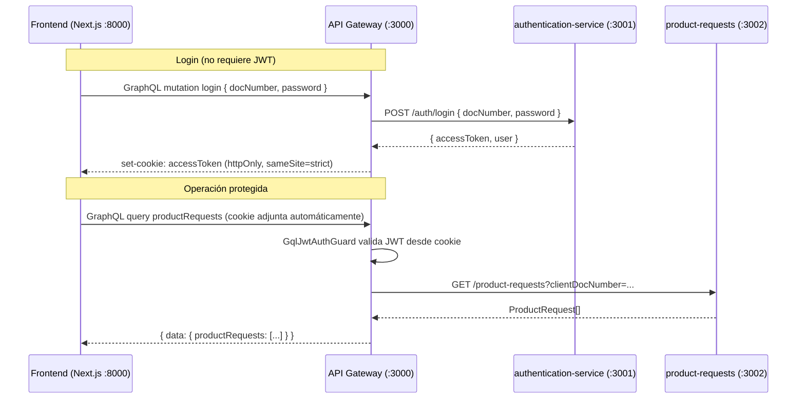

# api-gateway

Punto de entrada único de la plataforma. Es el único servicio expuesto a internet. Concentra cuatro responsabilidades transversales: autenticación y emisión de cookies seguras, validación de JWT en cada operación protegida, enrutamiento hacia los microservicios internos (`authentication-service` y `product-requests`), y protección perimetral (rate limiting, Helmet, CORS).

---

## Responsabilidad

El gateway no contiene lógica de negocio. Su función es:

1. **Autenticar** — delega las credenciales al `authentication-service`, recibe el JWT y lo persiste en una cookie `httpOnly`.
2. **Autorizar** — valida el JWT en cada operación GraphQL protegida mediante `GqlJwtAuthGuard`.
3. **Enrutar** — reenvía las operaciones de producto hacia `product-requests` vía HTTP REST interno.
4. **Proteger** — aplica rate limiting global, Helmet y CORS antes de que cualquier request llegue a los resolvers.

---

## Arquitectura

```
src/
├── app.module.ts            # Configuración global: GraphQL, ThrottlerModule, ConfigModule
├── main.ts                  # Bootstrap: Helmet, cookieParser, CORS, ValidationPipe
├── health.resolver.ts       # Query health: OK (liveness probe)
├── auth/
│   ├── auth.module.ts
│   ├── auth.resolver.ts     # Mutation login → cookie httpOnly
│   ├── auth.service.ts      # Proxy hacia authentication-service
│   └── dto / types/
├── product-requests/
│   ├── product-requests.module.ts
│   ├── product-requests.resolver.ts  # Queries y mutations protegidas con GqlJwtAuthGuard
│   ├── product-requests.service.ts   # Proxy hacia product-requests service
│   └── dto / types/
└── common/
    ├── guards/
    │   ├── gql-jwt-auth.guard.ts     # Adapta AuthGuard('jwt') para contexto GraphQL
    │   └── gql-throttler.guard.ts    # Adapta ThrottlerGuard para contexto GraphQL
    └── strategies/
        └── jwt.strategy.ts           # Extrae JWT de cookie o Bearer header
```

---

## Flujo de una operación autenticada



---

## API GraphQL

El esquema se genera automáticamente con `autoSchemaFile` y se expone en `http://localhost:3000/graphql`. La introspección está habilitada; el playground está deshabilitado.

### Operaciones públicas (sin JWT)

```graphql
mutation Login($input: LoginInput!) {
  login(input: $input) {
    user {
      fullName
      docType
      docNumber
    }
  }
}

query Health {
  health
}
```

> `health` no tiene guard — es una liveness probe llamada por el orquestador de contenedores (Docker healthcheck, Kubernetes) sin credenciales.

### Operaciones protegidas (requieren cookie `accessToken`)

```graphql
query GetProductRequests($clientDocNumber: String!) {
  productRequests(clientDocNumber: $clientDocNumber) {
    id status productType createdAt updatedAt
  }
}

query GetProductRequest($id: ID!) {
  productRequest(id: $id) {
    id clientDocNumber clientName productType status createdAt updatedAt
  }
}

mutation CreateProductRequest($input: CreateProductRequestInput!) {
  createProductRequest(input: $input) {
    id status createdAt
  }
}

mutation UpdateProductRequestStatus($id: ID!, $input: UpdateProductRequestStatusInput!) {
  updateProductRequestStatus(id: $id, input: $input) {
    id status updatedAt
  }
}

mutation DeleteProductRequest($id: ID!) {
  deleteProductRequest(id: $id)
}
```

---

## Seguridad

### Cookie httpOnly — por qué aquí y no en el frontend

El `accessToken` nunca se retorna en el body de la respuesta GraphQL. El resolver de login lo inyecta directamente en la cookie usando el objeto `Response` del contexto de Express:

```typescript
res.cookie('accessToken', accessToken, {
  httpOnly: true,       // inaccesible desde JavaScript — mitiga XSS
  sameSite: 'strict',   // no se envía en requests cross-site — mitiga CSRF
  secure: process.env.NODE_ENV === 'production',  // solo HTTPS en producción
  maxAge: this.cookieMaxAge,  // derivado de JWT_EXPIRES_IN — siempre alineado
});
```

El `maxAge` de la cookie se deriva automáticamente de `JWT_EXPIRES_IN` en el constructor del resolver mediante `jwtExpiresInToMs()`. Si la variable cambia (ej. de `1h` a `8h`), la cookie y el token expiran al mismo tiempo sin necesidad de cambiar código. El frontend nunca ve el token. Las peticiones posteriores lo adjuntan automáticamente mediante `credentials: 'include'`.

> **Entorno de desarrollo:** `secure` está condicionado a `NODE_ENV === 'production'`. En local la cookie se envía por HTTP — comportamiento esperado para agilizar el ciclo de desarrollo. En staging o CI la mejora es terminar TLS en el proxy con `secure: true`.

### Extracción del JWT

`JwtStrategy` intenta extraer el token de dos fuentes en orden:

1. Cookie `accessToken` (flujo normal del navegador)
2. Header `Authorization: Bearer <token>` (clientes API, herramientas de testing)

Si ninguna fuente provee un token válido, `GqlJwtAuthGuard` retorna `401 Unauthorized`.

### Rate limiting

`GqlThrottlerGuard` se aplica globalmente como `APP_GUARD`. Dos ventanas superpuestas:

| Ventana | Límite | Propósito |
|---|---|---|
| 1 segundo | 10 requests | Protección contra burst |
| 60 segundos | 100 requests | Protección contra scraping sostenido |

El guard está adaptado para contexto GraphQL: extrae `req`/`res` del contexto Apollo en lugar del contexto HTTP estándar de NestJS.

### Helmet y CORS

- **Helmet**: activo en todos los requests. `contentSecurityPolicy: false` está deshabilitado actualmente — era necesario durante el desarrollo con el playground de Apollo activo. El playground ya está deshabilitado (`playground: false` en `app.module.ts`); la mejora planificada es reactivar CSP con una política explícita (nonces para scripts) antes de un despliegue a producción.
- **CORS**: `origin` configurado desde `CORS_ORIGIN` (variable de entorno), `credentials: true` para permitir el envío de cookies.

---

## Diseño: `clientDocNumber` como argumento explícito

El query `productRequests` recibe `clientDocNumber` como argumento GraphQL en lugar de extraerlo del JWT. Esta es una decisión de diseño deliberada para soportar dos roles con el mismo endpoint:

| Rol | Comportamiento esperado |
|---|---|
| **Usuario** | Solo puede ver sus propias solicitudes — el `clientDocNumber` debería venir forzado desde el JWT |
| **Administrador** | Puede consultar solicitudes de cualquier cliente — necesita pasar `clientDocNumber` como argumento |

Reutilizar un único endpoint para ambos roles reduce la superficie de API y es coherente con el principio de mínima proliferación de operaciones GraphQL. El guard (`GqlJwtAuthGuard`) garantiza que cualquier llamador esté autenticado; la lógica de qué `clientDocNumber` puede consultar cada rol es una capa de autorización adicional.

**Por qué no se implementa la separación en esta prueba:** no existe un rol `ADMIN` definido en el sistema. Implementar autorización basada en roles sin un requisito concreto sería over-engineering.

**Cómo evolucionaría en producción:**

```typescript
// Opción A: mismo resolver, lógica de autorización por rol
async productRequests(
  @Args('clientDocNumber', { nullable: true }) clientDocNumber: string | undefined,
  @CurrentUser() user: JwtPayload,
): Promise<ProductRequestType[]> {
  const isAdmin = user.roles?.includes('ADMIN');
  const docNumber = isAdmin
    ? (clientDocNumber ?? throwIfMissing()) // admin debe pasar el parámetro
    : user.govIssueIdent.identSerialNum;    // usuario usa el suyo propio
  return this.service.findAll(docNumber);
}

// Opción B: separar en dos queries con guards distintos
@Query() @UseGuards(GqlJwtAuthGuard)       myProductRequests()     // usuario
@Query() @UseGuards(GqlAdminGuard)         clientProductRequests() // admin
```

La opción B es más limpia a escala: cada query tiene su propio contrato, sus propios tests y su propia política de autorización.

---

## Variables de entorno

| Variable | Descripción | Requerida | Default |
|---|---|---|---|
| `PORT` | Puerto del servidor | No | `3000` |
| `NODE_ENV` | Entorno (`development` / `production` / `test`) | No | `development` |
| `JWT_SECRET` | Clave de verificación del JWT (base64, mín. 32 chars) | Sí | — |
| `JWT_EXPIRES_IN` | Duración del token | No | `1h` |
| `CORS_ORIGIN` | Origen(es) permitidos (separados por coma) | No | `http://localhost:8000` |
| `AUTH_SERVICE_URL` | URL interna del `authentication-service` | Sí | — |
| `PRODUCT_REQUESTS_URL` | URL interna del `product-requests` | Sí | — |

---

## Ejecución local

```bash
npm install

cat > .env << 'EOF'
PORT=3000
NODE_ENV=development
JWT_SECRET=c3VwZXItc2VjcmV0LWtleS1mb3ItZGV2LW9ubHktY2hhbmdlLWluLXByb2R1Y3Rpb24tMzJjaGFycw==
JWT_EXPIRES_IN=1h
CORS_ORIGIN=http://localhost:8000
AUTH_SERVICE_URL=http://localhost:3001
PRODUCT_REQUESTS_URL=http://localhost:3002
EOF

npm run start:dev
```

---

## Ejecución con Docker

```bash
# Todo el stack (gateway depende de authentication-service y product-requests)
docker compose up -d

# Solo el gateway (asume que los otros servicios ya están corriendo)
docker compose up gateway
```

---

## Tests

```bash
npm run test        # unitarios
npm run test:cov    # cobertura
npm run test:e2e    # end-to-end
npm run test:watch  # watch mode
```

### Qué cubre cada suite

Para ver porcentajes detallados por archivo: `npm run test:cov`.

| Suite | Qué se verifica |
|---|---|
| `auth/auth.resolver` | Mutation `login` — llama a `AuthService`, setea cookie, retorna `user` |
| `auth/auth.service` | Proxy hacia `authentication-service` — éxito, `401` → `UnauthorizedException` |
| `product-requests/resolver` | Queries y mutations protegidas — delegan al servicio, guard activo |
| `product-requests/service` | Proxy hacia `product-requests` — parseo de fechas, manejo de `404` |
| `common/guards` | `GqlJwtAuthGuard` y `GqlThrottlerGuard` — extracción correcta del contexto GraphQL |

---

## Modos de falla

| Escenario | Comportamiento | Observación |
|---|---|---|
| `authentication-service` no disponible | `login` retorna `500` — Axios `ECONNREFUSED` no se mapea explícitamente | Sin retry ni circuit breaker — la llamada falla inmediatamente |
| `product-requests` no disponible | Operaciones protegidas retornan `500` | Mismo gap; sin timeout configurado |
| JWT expirado | `GqlJwtAuthGuard` retorna `401 Unauthorized` | Manejado automáticamente por Passport |
| `JWT_SECRET` rotado sin reinicio del proceso | Todos los tokens vigentes fallan validación | El servicio debe reiniciarse para recargar la variable |
| Rate limit excedido | `429 Too Many Requests` | Por ventana de 1 s (burst) o 60 s (sostenido) |
| `clientDocNumber` ausente en query | `400` — error de validación GraphQL antes de llegar al resolver | El motor GraphQL rechaza la petición; el argumento es `String!` no nullable |
| `clientDocNumber` presente pero vacío (`""`) | Se reenvía al servicio; retorna array vacío | `clientDocNumber` es un argumento escalar directo — `ValidationPipe` no aplica a escalares sin DTO. Sin validación en la capa gateway |

---

## Observabilidad

| Evento | Nivel | Nota |
|---|---|---|
| Gateway iniciado | `log` (console) | Puerto |
| Login exitoso | — (no se loguea) | El token nunca aparece en logs — diseño deliberado |
| JWT inválido / expirado | Manejado por Passport | `401` automático; sin log propio del gateway |

### Mejora planificada: logging estructurado

El gateway actualmente usa el `console.log` del bootstrap y los logs automáticos de NestJS/Passport — suficiente para el alcance de esta prueba. La optimización para producción es un interceptor de logging que registre cada operación GraphQL con `{ operationName, duration, statusCode, traceId }`, facilitando correlación de trazas entre servicios.

---

## Alcance de esta implementación — mejoras para producción

| Aspecto | Estado actual | Optimización para producción |
|---|---|---|
| `clientDocNumber` como argumento GraphQL | Diseño multi-rol explícito; ADMIN y usuario comparten endpoint | Queries separadas por rol (`myProductRequests` / `clientProductRequests`) con guards distintos |
| Cookie `secure` | `false` en desarrollo (HTTP local) | `true` en staging/producción con proxy TLS |
| CSP deshabilitado | `contentSecurityPolicy: false` durante desarrollo | CSP con nonces para scripts explícitamente permitidos |
| Logging estructurado | `console.log` del bootstrap + logs automáticos | Interceptor con `operationName`, `duration`, `traceId` para correlación distribuida |
| `JWT_SECRET` en variable de entorno | Base64 en `docker-compose.yml` | Secret manager (AWS Secrets Manager, HashiCorp Vault) |
| Timeout hacia servicios internos | Sin configurar | `timeout` explícito por llamada Axios + circuit breaker |
| Introspección GraphQL | Habilitada (facilita el desarrollo) | Deshabilitada en producción (`introspection: false`) |
