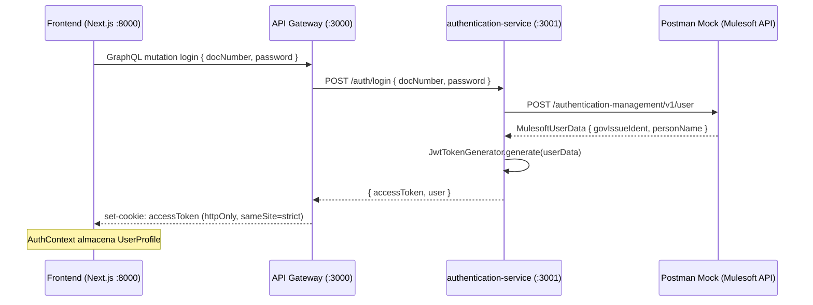
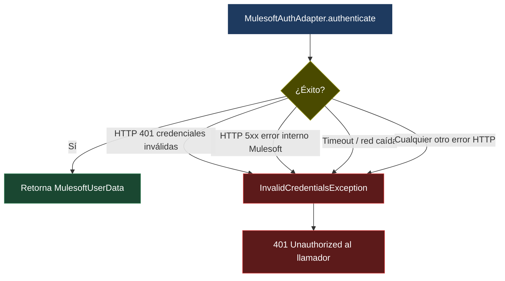
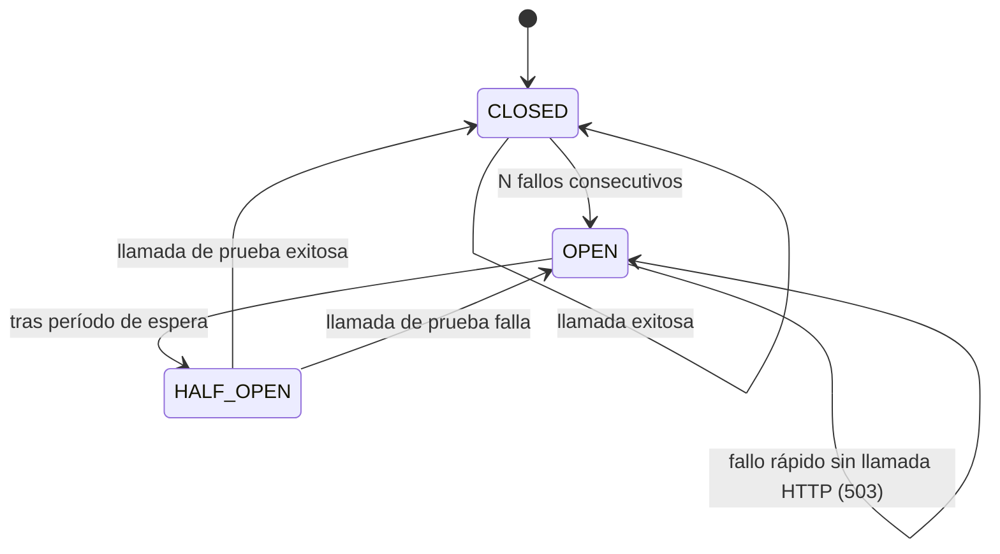
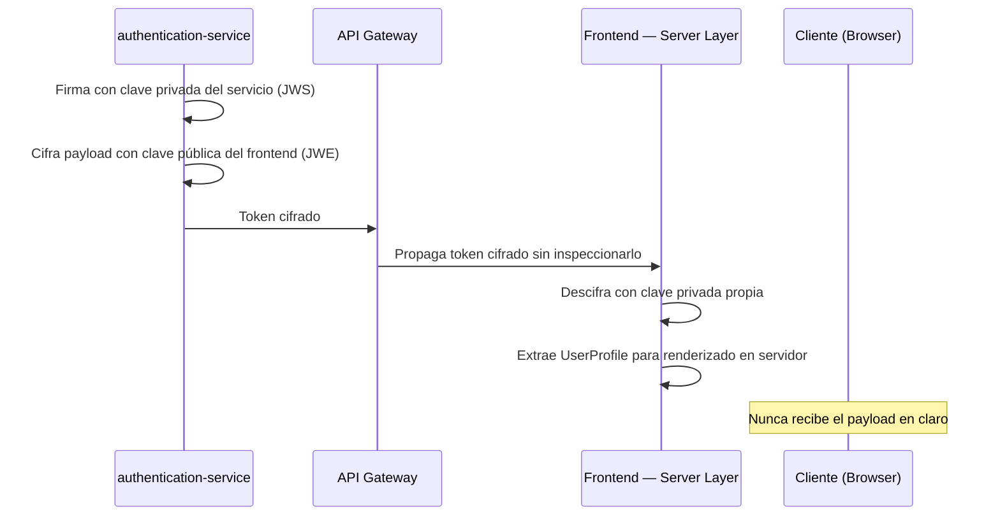
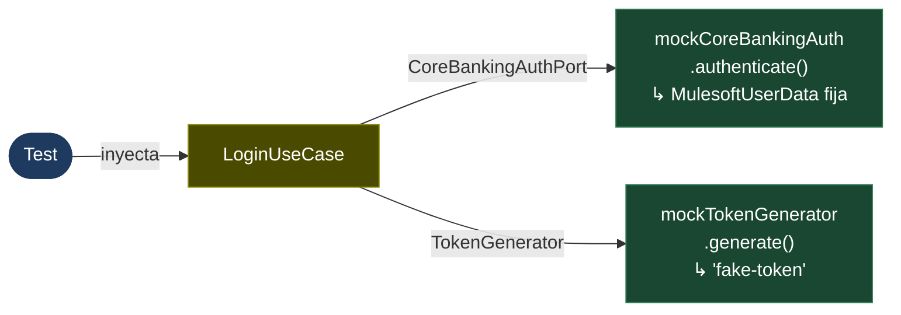

# authentication-service

Microservicio de autenticación de la plataforma bancaria. Valida las credenciales del usuario contra el core bancario institucional (Mulesoft) y emite un JWT firmado que acredita la identidad en el resto de la plataforma.

---

## Responsabilidad

Recibe número de documento y contraseña, los delega al core bancario a través de la API de Mulesoft, y — si la respuesta es exitosa — retorna un `accessToken` JWT firmado con los datos del usuario. El servicio no gestiona sesiones ni persiste ningún estado.

---

## Arquitectura

Sigue **Clean Architecture** con la regla de dependencia estricta: las capas internas no conocen las externas.

```
src/
├── domain/
│   └── exceptions/          # InvalidCredentialsException (error de dominio puro)
├── application/
│   ├── ports/               # CoreBankingAuthPort, TokenGenerator (contratos abstractos)
│   ├── use-cases/           # LoginUseCase (única lógica de negocio)
│   └── dtos/                # LoginRequestDto, LoginResponseDto
├── infrastructure/
│   ├── mulesoft/            # MulesoftAuthAdapter → implementa CoreBankingAuthPort
│   └── auth/                # JwtTokenGenerator   → implementa TokenGenerator
└── presentation/
    ├── controllers/         # AuthController: POST /auth/login
    └── filters/             # DomainExceptionFilter: mapea excepciones de dominio a HTTP
```

El dominio no importa nada de NestJS, Axios ni JWT. Los casos de uso dependen solo de los puertos (interfaces abstractas), lo que permite sustituir el adaptador de Mulesoft por cualquier otra implementación sin tocar la lógica de negocio.

---

## Integración con Mulesoft — Mock de Postman

En este entorno de evaluación, **no se dispone de acceso directo a la API de Mulesoft de producción**. Para simular el comportamiento del core bancario se utiliza un **mock server de Postman** que replica el contrato de la API institucional.

### URL del mock

```
https://df55ea6a-84ee-4da6-b351-218b8bdaf47e.mock.pstmn.io
```

Esta URL está configurada como `MULESOFT_BASE_URL` en el `docker-compose.yml` y en el `.env` local. El `MulesoftAuthAdapter` la consume para realizar la llamada de autenticación.

### Endpoint simulado

El mock expone el siguiente endpoint, replicando el contrato real de la API de Mulesoft:

```
POST /authentication-management/v1/user
```

**Request body:**
```json
{
  "docNumber": "12345678",
  "password": "secret"
}
```

**Response `200 OK` (credenciales válidas):**
```json
{
  "govIssueIdent": {
    "govIssueIdentType": "CC",
    "identSerialNum": "12345678"
  },
  "personName": {
    "fullName": "John Doe",
    "lastAuthInfo": {
      "lastTrnDt": "2024-01-01T00:00:00"
    }
  }
}
```

**Response `401 Unauthorized` (credenciales inválidas):**
```json
{
  "statusCode": 401,
  "error": "Unauthorized",
  "message": "Invalid document number or password"
}
```

> **Nota:** El mock de Postman está configurado para responder siempre con `200 OK` ante cualquier combinación de credenciales, simulando un usuario válido. En producción, el core bancario de Mulesoft validaría las credenciales reales y retornaría `401` cuando no coincidan.

---

## Flujo de autenticación completo



---

## Modos de falla y comportamiento ante errores de Mulesoft

### Comportamiento actual

El `MulesoftAuthAdapter` captura **cualquier error** que produzca la llamada HTTP a Mulesoft — credenciales inválidas, error 500, timeout o red caída — y lo convierte en una única excepción de dominio: `InvalidCredentialsException`, que el filtro de presentación mapea siempre a `401 Unauthorized`.



**Por qué este diseño es intencional:** desde la perspectiva del llamador (el API Gateway), la razón concreta del fallo no debe ser discernible. Distinguir entre "contraseña incorrecta" e "infraestructura no disponible" en la respuesta HTTP sería una fuga de información que un atacante podría explotar para determinar si el problema es de credenciales o de disponibilidad del sistema.

**Limitación conocida para esta prueba:** no hay timeout configurado en el `HttpModule`. Si Mulesoft (o el mock) no responde, el request cuelga indefinidamente. En la práctica, con el mock de Postman esto no ocurre, pero en producción es un riesgo crítico.

### Deuda técnica documentada — lo que requeriría un entorno productivo

#### 1. Timeout explícito

El módulo HTTP debe tener un timeout razonable para no dejar hilos colgados:

```typescript
// auth.module.ts
HttpModule.register({
  timeout: 5000,       // 5 s máximo de espera
  maxRedirects: 0,
})
```

#### 2. Distinción entre fallo de credenciales y fallo de infraestructura

Con timeout configurado, el adaptador puede diferenciar los errores y lanzar excepciones distintas:

```typescript
} catch (error) {
  if (error.response?.status === 401) {
    throw new InvalidCredentialsException();           // dominio: credenciales incorrectas
  }
  throw new CoreBankingUnavailableException();         // infraestructura: Mulesoft caído
}
```

`CoreBankingUnavailableException` se mapearía a `503 Service Unavailable`, dando al gateway la posibilidad de reintentarlo o de retornar un error diferenciado al cliente.

#### 3. Circuit breaker

Si Mulesoft está caído, cada request seguirá llegando al adaptador, ejecutando la llamada HTTP, esperando el timeout y fallando. Con alto volumen, esto satura el pool de conexiones. El patrón correcto es un circuit breaker que, tras N fallos consecutivos, abre el circuito y falla rápido sin hacer la llamada:



Librerías candidatas: `opossum` (nativo Node.js) o el módulo `@nestjs/resilience`.

#### 4. Verificación SSL

El `HttpModule` está configurado con `rejectUnauthorized: false` para tolerar el certificado del mock de Postman. En producción, este flag **debe eliminarse** y el certificado de Mulesoft debe ser validado por la CA corporativa:

```typescript
// ✗ Evaluación (mock de Postman)
httpsAgent: new https.Agent({ rejectUnauthorized: false })

// ✓ Producción
httpsAgent: new https.Agent({ rejectUnauthorized: true, ca: corporateCert })
```

---

## Seguridad

### Responsabilidad de este servicio en la cadena de seguridad

`authentication-service` tiene una responsabilidad única y acotada: **validar credenciales contra el core bancario y emitir un JWT firmado**. No es su responsabilidad decidir cómo ese token viaja al cliente ni cómo se persiste en el navegador.

La responsabilidad de proteger el token en tránsito hacia el cliente recae en el **API Gateway**, que es el único componente expuesto a internet. Es el gateway quien:

- Recibe el `accessToken` que este servicio retorna
- Lo persiste en una cookie `httpOnly + sameSite=strict + secure` (inaccesible desde JavaScript)
- Lo adjunta automáticamente en cada solicitud posterior mediante `credentials: 'include'`
- Lo valida en cada operación protegida a través del guard de JWT

Este servicio y el gateway **conviven en el mismo cluster privado** (red Docker interna en desarrollo, VPC en producción). La comunicación entre ellos nunca sale a internet, por lo que la superficie de ataque entre ambos es mínima y controlada.

### Datos sensibles — qué nunca se registra

Independientemente del entorno, los siguientes valores **nunca se emiten en logs**:

- La contraseña del usuario (ni en texto plano ni hasheada)
- El `accessToken` completo
- El payload interno del JWT

Lo único que se registra es el `docNumber`, exclusivamente para trazabilidad operacional.

### Consideración de seguridad fuera del alcance de esta prueba: payload cifrado

En un entorno de producción real con requisitos de seguridad elevados, el payload del JWT debería viajar **cifrado mediante criptografía asimétrica (JWE — JSON Web Encryption)**. El esquema sería:



Esto garantiza que **incluso si el token fuera interceptado en tránsito**, su contenido permanece ilegible para cualquier actor que no sea el destinatario legítimo. La separación de responsabilidades se mantiene: este servicio cifra para el destinatario, el gateway solo transporta, el frontend descifra en su capa segura de servidor.

**Por qué no se implementa en esta prueba:** `authentication-service` y el API Gateway viven en la misma red privada del cluster. El riesgo de intercepción entre ambos es técnicamente despreciable, y la complejidad operacional de gestionar pares de claves asimétricas (rotación, distribución, revocación) no está justificada para el alcance de la evaluación.

---

## Endpoint expuesto por este servicio

### `POST /auth/login`

**Request:**
```json
{
  "docNumber": "12345678",
  "password": "secret"
}
```

**Response `200 OK`:**
```json
{
  "accessToken": "<JWT>",
  "user": {
    "fullName": "John Doe",
    "docType": "CC",
    "docNumber": "12345678"
  }
}
```

**Response `401 Unauthorized`:**
```json
{
  "statusCode": 401,
  "error": "Unauthorized",
  "message": "Invalid document number or password"
}
```

---

## Variables de entorno

| Variable | Descripción | Requerida | Default |
|---|---|---|---|
| `PORT` | Puerto del servidor | No | `3001` |
| `NODE_ENV` | Entorno (`development` / `production` / `test`) | No | `development` |
| `JWT_SECRET` | Clave de firma del JWT (mín. 32 caracteres) | Sí | — |
| `JWT_EXPIRES_IN` | Duración del token (ej. `1h`, `7d`) | No | `1h` |
| `MULESOFT_BASE_URL` | URL base del mock de Postman (o de Mulesoft en producción) | Sí | — |

---

## Ejecución local

```bash
# Instalar dependencias
npm install

# Crear archivo de entorno a partir de la tabla de variables de entorno
cat > .env << 'EOF'
PORT=3001
NODE_ENV=development
JWT_SECRET=<clave-minimo-32-caracteres>
JWT_EXPIRES_IN=1h
MULESOFT_BASE_URL=https://df55ea6a-84ee-4da6-b351-218b8bdaf47e.mock.pstmn.io
EOF

# Desarrollo con hot-reload
npm run start:dev

# Producción
npm run start:prod
```

## Ejecución con Docker

```bash
# Solo este servicio (levanta también los que dependan de él si están declarados)
docker compose up authentication-service

# Todo el stack
docker compose up -d
```

---

## Tests

```bash
# Unitarios
npm run test

# Unitarios con cobertura
npm run test:cov

# Watch mode
npm run test:watch
```

### Por qué los tests no necesitan levantar un servidor ni llamar al mock

El patrón puerto/adaptador es la razón directa. `LoginUseCase` no depende de `MulesoftAuthAdapter` ni de `JwtTokenGenerator` — depende de sus contratos abstractos (`CoreBankingAuthPort` y `TokenGenerator`). En los tests se inyectan mocks que implementan esas interfaces:



No hay Axios, no hay red, no hay NestJS levantado. Cada test termina en milisegundos y es completamente determinista: el resultado no depende de si el mock de Postman está disponible ni del estado de ningún servicio externo.

### Cobertura por capa

| Capa | Qué se testea |
|---|---|
| `domain` | `InvalidCredentialsException` — mensaje y nombre de la excepción |
| `application` | `LoginUseCase` — camino feliz, credenciales inválidas, mapeo de `MulesoftUserData` a `LoginResponseDto` |
| `infrastructure/mulesoft` | `MulesoftAuthAdapter` — respuesta exitosa, cualquier error HTTP → `InvalidCredentialsException` |
| `infrastructure/auth` | `JwtTokenGenerator` — token generado con el payload correcto |
| `presentation/filters` | `DomainExceptionFilter` — `InvalidCredentialsException` → `401` con body correcto |
| `presentation/controllers` | `AuthController` — delega al `LoginUseCase` y retorna su resultado |

---

## Cómo extender — sustituir el proveedor de autenticación

Si en el futuro el core bancario cambia de Mulesoft a otro proveedor (un sistema propio, Azure AD, otro API), **no hay que tocar `LoginUseCase` ni ninguna otra capa**. Solo se necesita:

**1.** Crear un nuevo adaptador que implemente `CoreBankingAuthPort`:

```typescript
// src/infrastructure/nuevo-proveedor/nuevo-proveedor-auth.adapter.ts
@Injectable()
export class NuevoProveedorAuthAdapter extends CoreBankingAuthPort {
  async authenticate(docNumber: string, password: string): Promise<MulesoftUserData> {
    // Lógica de integración con el nuevo sistema
  }
}
```

**2.** Cambiar el binding en `auth.module.ts`:

```typescript
// Antes
{ provide: CORE_BANKING_AUTH, useClass: MulesoftAuthAdapter }

// Después
{ provide: CORE_BANKING_AUTH, useClass: NuevoProveedorAuthAdapter }
```

Listo. `LoginUseCase`, los tests existentes (con mocks), `DomainExceptionFilter` y `AuthController` no cambian.

---

## Observabilidad

Los logs se emiten a través del `ConsoleLogger` de NestJS:

- **`NODE_ENV=development`**: texto con colores en consola
- **`NODE_ENV=production`**: JSON estructurado (compatible con Grafana/Loki)

### Eventos registrados

| Evento | Nivel | Campos incluidos |
|---|---|---|
| Llamada saliente a Mulesoft | `log` | `docNumber`, URL del endpoint |
| Autenticación exitosa en Mulesoft | `log` | `docNumber` |
| Fallo de autenticación (cualquier causa) | `warn` | `docNumber`, mensaje de error |

### Lo que nunca aparece en logs

- La contraseña del usuario (ni en texto plano ni hasheada)
- El `accessToken` emitido
- El payload interno del JWT

### Deuda técnica: correlación de trazas

En producción, cada request debería generar un `traceId` propagado en todos los logs de esa operación. Esto permite reconstruir el flujo completo en Grafana/Loki cuando un login falla: desde el gateway hasta Mulesoft, en una sola búsqueda por `traceId`. La implementación estándar en NestJS es `AsyncLocalStorage` o un interceptor que inyecte el header `X-Request-ID`.

---

## Alcance de esta implementación vs entorno productivo

Esta tabla resume explícitamente qué está listo para producción, qué es deuda técnica conocida y qué está fuera del alcance por diseño:

| Aspecto | Estado en esta prueba | En producción |
|---|---|---|
| Validación de credenciales contra Mulesoft | Mock de Postman (siempre `200`) | API real con credenciales reales |
| Timeout en llamada a Mulesoft | No configurado | `timeout: 5000`, `maxRedirects: 0` |
| SSL hacia Mulesoft | `rejectUnauthorized: false` | CA corporativa configurada |
| Circuit breaker | No implementado | `opossum` o `@nestjs/resilience` |
| Diferenciación `401` vs `503` | No (todo es `401`) | `InvalidCredentials` vs `CoreBankingUnavailable` |
| Payload JWT cifrado (JWE) | No (solo firmado) | JWE asimétrico si el canal no está en VPC |
| `JWT_SECRET` en docker-compose | Hardcodeado (base64) | Secret manager (AWS Secrets Manager, Vault) |
| Persistencia del token en navegador | Cookie `httpOnly + sameSite` (gateway) | Igual — ya está bien |
| Tests unitarios por capa | Completos | Igual + tests de integración contra Mulesoft real |
| Logs estructurados | JSON en producción | Igual + correlación de trazas (traceId) |

---

## Decisión técnica: JWT simple vs OAuth 2.0

Para el alcance de esta prueba se implementó **JWT simple**: el cliente envía credenciales, el servicio las valida y retorna un token. Es la opción más directa y suficiente para un único cliente (la SPA).

En un entorno productivo con múltiples clientes (apps móviles, integraciones de terceros, portales institucionales), la evolución natural sería **OAuth 2.0**:

- **Delegación controlada**: el cliente accede a recursos en nombre del usuario sin exponer sus credenciales, usando `grant_type` y `scopes`.
- **Gestión de clientes**: cada aplicación se registra con `client_id`/`client_secret`, habilitando auditoría y revocación granular.
- **Refresh tokens**: la sesión se renueva sin requerir credenciales nuevamente.
- **Interoperabilidad**: gateways, SDKs y herramientas de seguridad ya entienden el protocolo.

La migración implicaría: campos `grant_type`, `client_id`, `client_secret` en el request; respuesta conforme a RFC 6749 (`token_type`, `expires_in`, `refresh_token`); un store persistente para refresh tokens; y un registro de clientes autorizados.
