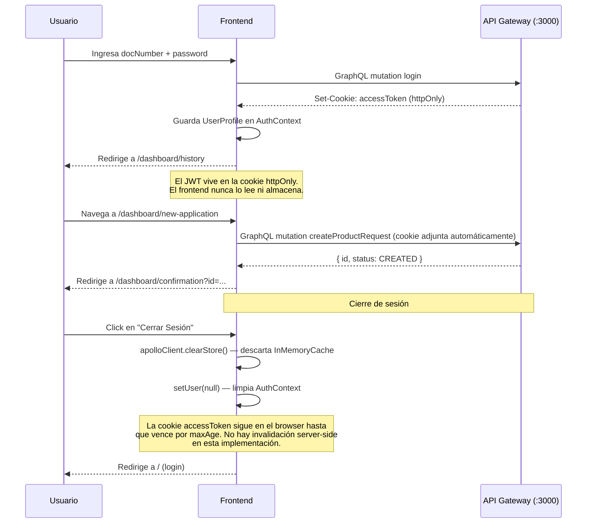

# frontend

Interfaz web de la plataforma bancaria. Construida con Next.js 16 (App Router) y React 19. Se comunica con el `api-gateway` vía GraphQL. El diseño de sesión prioriza la seguridad sobre la comodidad: el JWT vive únicamente en una cookie `httpOnly` gestionada por el servidor — el bundle del cliente nunca accede al token. El estado de sesión en memoria (`AuthContext`) se limpia completamente al cerrar sesión, incluyendo el caché de Apollo.

---

## Stack

| Capa | Tecnología |
|---|---|
| Framework | Next.js 16.2.7 — App Router |
| UI | React 19, Tailwind CSS |
| Cliente GraphQL | Apollo Client 4 (`@apollo/client`) |
| Estado de sesión | `AuthContext` — React Context + `useState` |
| Tests | Jest + React Testing Library |
| Contenerización | Docker (standalone output) |

---

## Arquitectura

```
src/
├── app/                          # App Router — rutas y layouts
│   ├── layout.tsx                # Root layout: ApolloProvider + AuthProvider
│   ├── page.tsx                  # Redirect a /dashboard o /login
│   └── dashboard/
│       ├── layout.tsx            # Dashboard layout: SideNavBar + contenido
│       ├── new-application/      # Página: nueva solicitud
│       ├── confirmation/         # Página: confirmación post-creación
│       └── history/              # Página: historial con paginado local
├── modules/
│   └── applications/
│       └── components/
│           ├── NewApplicationForm.tsx   # Formulario de nueva solicitud
│           ├── ProductRadioCard.tsx     # Selector de producto
│           └── InfoCard.tsx             # Tarjeta informativa reutilizable
├── components/
│   └── layout/
│       └── SideNavBar.tsx        # Navegación lateral del dashboard
└── lib/
    ├── apollo-client.ts          # Singleton de ApolloClient (browser) / instancia por request (SSR)
    ├── apollo-provider.tsx       # ApolloProvider para el árbol de componentes
    ├── auth-context.tsx          # AuthContext: usuario autenticado en memoria
    └── graphql/
        └── mutations/
            └── product-requests.mutations.ts  # Queries y mutations de solicitudes
```

---

## Flujo de autenticación



---

## Seguridad

### Cadena de protección del token

El diseño elimina intencionalmente el JWT del alcance de JavaScript:

| Mecanismo | Implementación | Amenaza mitigada |
|---|---|---|
| Cookie `httpOnly` | Seteada por el gateway — el frontend no puede leerla con `document.cookie` | XSS no puede robar el token |
| `credentials: 'include'` en Apollo | El browser adjunta la cookie automáticamente en cada operación GraphQL | No se necesita gestionar el token manualmente |
| `sameSite: 'strict'` | La cookie no se envía en requests cross-site | CSRF |
| `AuthContext` en memoria | El perfil del usuario vive en React state — se pierde al recargar | No persiste en `localStorage` ni `sessionStorage` — no accesible desde extensiones maliciosas |

### Limpieza del caché de Apollo en logout

Al cerrar sesión, `handleLogout` en `SideNavBar` llama a `apolloClient.clearStore()` antes de limpiar el contexto y redirigir. Esto garantiza que en un dispositivo compartido, un segundo usuario no vea datos cacheados del usuario anterior:

```typescript
const apolloClient = useApolloClient();

const handleLogout = async () => {
  await apolloClient.clearStore(); // limpia el InMemoryCache sin relanzar queries activas
  setUser(null);
  router.push('/');
};
```

`clearStore()` descarta el caché sin relanzar queries activas. La diferencia con `resetStore()` es crítica en este contexto: `resetStore` relanza todas las queries activas después de limpiar — con credenciales ya inexistentes, eso generaría una cascada de `401` innecesarios. `clearStore` es la opción correcta en logout.

El orden de las tres operaciones también es intencional: el caché se limpia **antes** de invalidar el contexto y redirigir, garantizando que ningún componente en el árbol de React lea datos del usuario anterior durante el desmontaje.

### Gap documentado: sin protección de rutas en middleware

Las rutas `/dashboard/*` son accesibles por URL directa sin cookie. El gateway retorna `401` en las queries y el usuario ve errores en pantalla, pero la página renderiza. Sin un `middleware.ts` de Next.js que verifique la presencia de la cookie antes de servir el HTML, no hay redirección automática al login. Ver mejora planificada más abajo.

---

## Rutas

| Ruta | Componente | Descripción |
|---|---|---|
| `/` | `app/page.tsx` | Redirige a `/dashboard/history` si hay sesión, si no muestra login |
| `/dashboard/new-application` | `NewApplicationForm` | Formulario de nueva solicitud — requiere sesión |
| `/dashboard/confirmation` | `ConfirmationContent` | Confirmación post-creación — lee `?id=` y `?product=` de la URL |
| `/dashboard/history` | `HistorialPage` | Historial paginado — query `productRequests` con `fetchPolicy: cache-and-network` |

> Las rutas `/dashboard/*` no tienen protección a nivel de middleware en esta implementación. Ver mejora planificada **Protección de rutas**.

---

## Persistencia de estado

El frontend no usa base de datos ni localStorage. El estado de sesión vive exclusivamente en `AuthContext`:

```typescript
// AuthContext guarda el perfil del usuario en memoria React
const [user, setUser] = useState<UserProfile | null>(null);
// { fullName, docType, docNumber }
```

**Consecuencia deliberada:** si el usuario recarga la página, pierde la sesión en el contexto aunque la cookie siga vigente. El comportamiento esperado es que el usuario vuelva a hacer login. La mejora planificada con la arquitectura BFF es que el `layout.tsx` raíz sea un Server Component que valide la cookie server-side y rehidrate el contexto sin interacción adicional del usuario. Ver sección **BFF** en Mejoras planificadas.

---

## Paginación en el historial

La paginación del historial es **local** (client-side) — no se hace una query por página al servidor:

```typescript
const PAGE_SIZE = 5;
const totalPages = Math.max(1, Math.ceil(requests.length / PAGE_SIZE));
const paginated = requests.slice((page - 1) * PAGE_SIZE, page * PAGE_SIZE);
```

Apollo carga todos los registros del cliente en una sola query y el componente pagina el array en memoria. Esto es correcto para un volumen de solicitudes por cliente moderado. La mejora planificada para volúmenes grandes es paginación server-side con `limit`/`offset` o cursor-based pagination en el schema GraphQL.

La query usa `fetchPolicy: 'cache-and-network'`: muestra datos cacheados inmediatamente al navegar de regreso al historial, y lanza una petición al servidor en paralelo para reflejar solicitudes recién creadas.

---

## Variables de entorno

| Variable | Descripción | Requerida | Default |
|---|---|---|---|
| `NEXT_PUBLIC_GRAPHQL_URL` | URL del API Gateway (visible en el cliente) | No | `http://localhost:3000/graphql` |
| `PORT` | Puerto del servidor Next.js | No | `8000` |

> `NEXT_PUBLIC_*` se incrusta en el bundle en tiempo de build — no puede contener secretos. Ver mejora planificada BFF más abajo.

---

## Ejecución local

```bash
npm install

# Opcional: configurar variables de entorno
echo "NEXT_PUBLIC_GRAPHQL_URL=http://localhost:3000/graphql" > .env.local

npm run dev        # http://localhost:8000
```

---

## Ejecución con Docker

```bash
# Todo el stack (incluye frontend)
docker compose up -d

# Solo el frontend
docker compose up frontend

# Build con URL del gateway personalizada
docker compose build --build-arg NEXT_PUBLIC_GRAPHQL_URL=https://api.midominio.com/graphql frontend
```

El Dockerfile usa **standalone output** de Next.js — la imagen final solo incluye los archivos necesarios para ejecutar el servidor, sin `node_modules` completos.

---

## Tests

```bash
npm run test        # unitarios
npm run test:watch  # watch mode
```

### Qué cubre cada suite

Para ver porcentajes detallados por archivo: `npm run test:cov`.

| Suite | Qué se verifica |
|---|---|
| `auth-context.test.tsx` | `AuthProvider` provee contexto; `useAuth` lanza fuera del provider; `setUser` actualiza el estado |
| `history-utils.test.ts` | `formatDate` formatea fechas en locale `es-CO`; manejo correcto de zona horaria |
| `SideNavBar.test.tsx` | Renderiza links y brand; marca link activo; limpia caché Apollo y llama `setUser(null)` + redirect en logout |
| `AuthForm.test.tsx` | Renderiza todos los campos; submit llama `login` con las variables correctas; muestra error de servidor |
| `ProductsSection.test.tsx` | Renderiza los productos del catálogo |

---

## Modos de falla

| Escenario | Comportamiento | Nota |
|---|---|---|
| Gateway no disponible | Apollo muestra error en la UI; formulario de login muestra mensaje de error | Sin retry automático |
| Cookie expirada / JWT inválido | Gateway retorna `401`; Apollo retorna error en la query | El frontend no redirige automáticamente — el usuario ve el error en pantalla |
| Recarga de página | `AuthContext` se reinicia — `user` es `null` | El estado de sesión no se rehidrata desde la cookie; usuario debe re-autenticarse |
| `clientDocNumber` vacío en historial | Query se omite (`skip: !user?.docNumber`) | No se hace la petición — la tabla muestra estado vacío |

---

## Mejoras planificadas

### BFF (Backend for Frontend)

Esta es la mejora de mayor impacto arquitectónico. En el diseño actual el browser se comunica directamente con el gateway:

```
[Browser]  ──GraphQL──▶  [API Gateway :3000]
              CORS abierto al origen del frontend
              NEXT_PUBLIC_GRAPHQL_URL en el bundle
```

Con BFF, el servidor de Next.js actúa como intermediario usando una API Route (`/app/api/graphql/route.ts`):

```
[Browser]  ──GraphQL──▶  [Next.js Server :8000]  ──HTTP──▶  [API Gateway :3000]
              sin CORS                                CORS cerrado (solo BFF)
              sin URLs expuestas                      variables sensibles server-only
```

Qué cambia concretamente:

| Aspecto | Sin BFF (actual) | Con BFF |
|---|---|---|
| URL del gateway | En el bundle (`NEXT_PUBLIC_*`) | Variable de servidor (`process.env`, no accesible desde el browser) |
| CORS en el gateway | Abierto al origen del frontend | Cerrado — solo acepta requests del BFF |
| Clave privada RSA | Requiere endpoint separado | Gestionada en el mismo proceso Next.js |
| `secret_key` de reCAPTCHA | Requiere proxy | Llamada server-side directa a la API de Google |
| Rehidratación de sesión | `AuthContext` se pierde al recargar | Server Component en `layout.tsx` valida la cookie y pasa el `UserProfile` como prop |
| Invalidación de sesión | Solo client-side (clearStore + setUser) | El BFF puede llamar a un endpoint de revocación en el gateway y limpiar la cookie desde el servidor |
| Escalabilidad | El gateway gestiona CORS por origen | El gateway solo ve un origen — simplifica la política de seguridad |

### Protección de rutas (`middleware.ts`)

Next.js permite interceptar todas las peticiones antes de que se renderice cualquier página mediante un archivo `middleware.ts` en la raíz del proyecto. La implementación revisa la presencia de la cookie y redirige al login si no existe:

```typescript
// middleware.ts
import { NextRequest, NextResponse } from 'next/server';

export function middleware(req: NextRequest) {
  const token = req.cookies.get('accessToken');
  if (!token) {
    return NextResponse.redirect(new URL('/', req.url));
  }
  return NextResponse.next();
}

export const config = {
  matcher: ['/dashboard/:path*'],
};
```

Esto valida la **presencia** de la cookie, no su firma. La validación criptográfica del JWT sigue siendo responsabilidad del gateway — el middleware es la primera línea de defensa para evitar que páginas protegidas rendericen sin sesión.

### reCAPTCHA v3 en el formulario de login

reCAPTCHA v3 es invisible para el usuario: no muestra ningún reto visual. El navegador genera un **token de puntuación** (0.0–1.0) que el backend valida contra la API de Google. Una puntuación inferior a `0.5` indica actividad automatizada.

```typescript
// En el handler del formulario de login
const token = await window.grecaptcha.enterprise.execute(
  process.env.NEXT_PUBLIC_RECAPTCHA_SITE_KEY!,
  { action: 'LOGIN' },
);

// El token se envía junto con las credenciales
await login({ variables: { input: { docNumber, password, recaptchaToken: token } } });
```

El gateway llama a `https://recaptchaenterprise.googleapis.com/v1/projects/:project/assessments` con el token y la `secret_key` (que nunca sale del servidor) y rechaza el login si la puntuación es insuficiente. El `NEXT_PUBLIC_RECAPTCHA_SITE_KEY` es seguro de exponer al cliente — es la clave pública del par.

### Cifrado asimétrico RSA-OAEP en el login

HTTPS cifra el tránsito, pero las credenciales viajan en claro dentro del payload GraphQL después de que TLS termina en el proxy/balanceador. El cifrado asimétrico del payload añade una capa de defensa-en-profundidad:

```
Frontend                              Gateway
  1. GET /auth/public-key  ──────────▶  retorna clave pública RSA (PEM)
  2. Cifra { docNumber, password }      
     con RSA-OAEP + SHA-256  
  3. mutation login(encryptedPayload)──▶ descifra con clave privada
                                         procede con el login normal
```

Implementación en el frontend usando la API nativa `SubtleCrypto` (sin dependencias externas):

```typescript
async function encryptCredentials(
  publicKeyPem: string,
  payload: { docNumber: string; password: string },
): Promise<string> {
  const binaryKey = pemToArrayBuffer(publicKeyPem);
  const cryptoKey = await crypto.subtle.importKey(
    'spki',
    binaryKey,
    { name: 'RSA-OAEP', hash: 'SHA-256' },
    false,
    ['encrypt'],
  );
  const encrypted = await crypto.subtle.encrypt(
    { name: 'RSA-OAEP' },
    cryptoKey,
    new TextEncoder().encode(JSON.stringify(payload)),
  );
  return btoa(String.fromCharCode(...new Uint8Array(encrypted)));
}
```

La clave privada nunca sale del servidor. Si el tráfico es interceptado después de que TLS termina — proxy corporativo con inspección SSL, log de payloads en un nodo intermedio, o dump de memoria en el gateway — las credenciales siguen siendo ilegibles.

**Por qué `SubtleCrypto` y no una librería externa:** `SubtleCrypto` es la API criptográfica nativa del browser (W3C), disponible en todos los entornos modernos sin dependencias. No aumenta el bundle, sus implementaciones son auditadas por los vendors del browser, y en contextos enterprise es compatible con FIPS 140-2. Una librería de terceros como `node-forge` añadiría ~200 KB al bundle y una superficie de ataque adicional en la cadena de suministro.

### Paginación server-side

Reemplazar la paginación local por `limit`/`offset` en el schema GraphQL cuando el volumen de solicitudes por cliente lo justifique.

